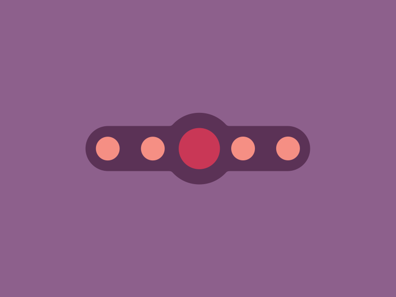

# TKRubberPageControl

> 一个 iOS 橡皮筋动画页码指示器，同时提供 UIKit 和 SwiftUI 版本。



[English](./README.md) | 中文说明

## 特性

- 原版的橡皮筋动画：大球在页面间移动，小球沿横条下方的半圆轨迹弹跳，并在飞行中
  挤压变形。
- 基于 `UIControl` 的 UIKit 版本，与 1.x 源码兼容。
- 原生的、由 `Binding` 驱动的 SwiftUI 版本，没有使用 `UIViewRepresentable`。
- 两个版本共享同一套布局模型，因此外观完全一致。
- 支持样式配置、深色模式和基础无障碍功能。

## 环境要求

- iOS 13.0+
- Swift 5.9+
- Xcode 15+

## 安装

### Swift Package Manager

在 Xcode 中通过 **File → Add Package Dependencies** 添加：

```
https://github.com/TBXark/TKRubberIndicator
```

或者在 `Package.swift` 中添加：

```swift
dependencies: [
    .package(url: "https://github.com/TBXark/TKRubberIndicator.git", from: "2.0.0")
]
```

### CocoaPods

```ruby
pod 'TKRubberPageControl', '~> 2.0'
```

## 使用

### UIKit

```swift
import TKRubberPageControl
import UIKit

final class ViewController: UIViewController {

    private let pageControl = TKRubberPageControl(frame: .zero, count: 5)

    override func viewDidLoad() {
        super.viewDidLoad()

        pageControl.translatesAutoresizingMaskIntoConstraints = false
        pageControl.addTarget(
            self,
            action: #selector(pageChanged(_:)),
            for: .valueChanged
        )
        pageControl.valueChange = { index in
            print("page is \(index)")
        }

        view.addSubview(pageControl)
        NSLayoutConstraint.activate([
            pageControl.centerXAnchor.constraint(equalTo: view.centerXAnchor),
            pageControl.widthAnchor.constraint(equalToConstant: 220),
            pageControl.heightAnchor.constraint(equalToConstant: 100),
        ])
    }

    @objc private func pageChanged(_ sender: TKRubberPageControl) {
        print("page is \(sender.currentIndex)")
    }
}
```

直接设置 `currentIndex` 同样会播放动画并触发事件；设置 `numberOfPage` 或
`styleConfig` 会重建指示器并把选中项重置为 `0`：

```swift
pageControl.currentIndex = 2   // 动画切换到第 2 页
pageControl.numberOfPage = 4   // 重建，回到第 0 页
```

### SwiftUI

```swift
import SwiftUI
import TKRubberPageControl

struct ContentView: View {
    @State private var page = 0

    var body: some View {
        RubberPageControl(selection: $page, pageCount: 5)
            .frame(width: 220, height: 100)
    }
}
```

选中状态保存在 Binding 中，状态变化时控件自动更新，用户点击时写回状态。iOS 15
及以上会自动播放动画；iOS 13 和 14 需要用 `withAnimation` 包裹赋值：

```swift
withAnimation {
    page = 3
}
```

## 样式配置

`TKRubberPageControlConfig` 和 `RubberPageControlStyle` 提供相同的配置项，默认值
与 1.x 版本一致。

| 配置项 | 说明 | 默认值 |
|---|---|---|
| `smallBubbleSize` | 小球直径 | `16` |
| `mainBubbleSize` | 选中大球背后凸起的直径 | `40` |
| `bubbleXOffsetSpace` / `bubbleSpacing` | 球间距 | `12` |
| `bubbleYOffsetSpace` / `verticalPadding` | 横条纵向内边距 | `8` |
| `animationDuration` | 切换动画时长 | `0.2` |
| `backgroundColor` / `barColor` | 横条和凸起颜色 | 紫褐色 |
| `smallBubbleColor` | 小球颜色 | 珊瑚色 |
| `bigBubbleColor` | 大球颜色 | 绯红色 |

UIKit：

```swift
var config = TKRubberPageControlConfig()
config.backgroundColor = .systemIndigo
config.bigBubbleColor = .systemYellow
let pageControl = TKRubberPageControl(frame: frame, count: 5, config: config)
```

SwiftUI：

```swift
RubberPageControl(
    selection: $page,
    pageCount: 5,
    style: RubberPageControlStyle(barColor: .indigo, bigBubbleColor: .yellow)
)
```

## 示例

示例工程同时展示 UIKit 和 SwiftUI 两个版本，使用
[XcodeGen](https://github.com/yonaskolb/XcodeGen) 生成，并以本地 Swift Package
的方式依赖当前库：

```bash
./Scripts/demo.sh
```

或者运行 `make demo`。

## 协议

TKRubberPageControl 基于 MIT 协议开源，详见 [LICENSE](./LICENSE)。
